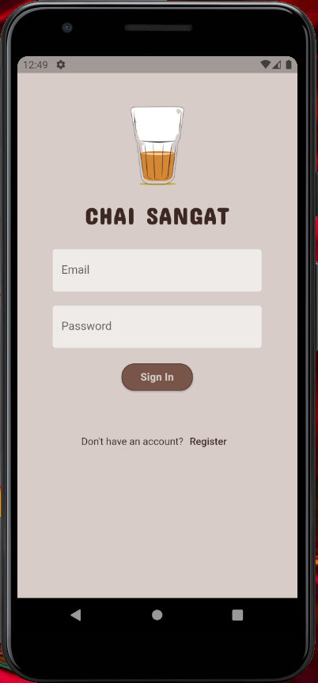
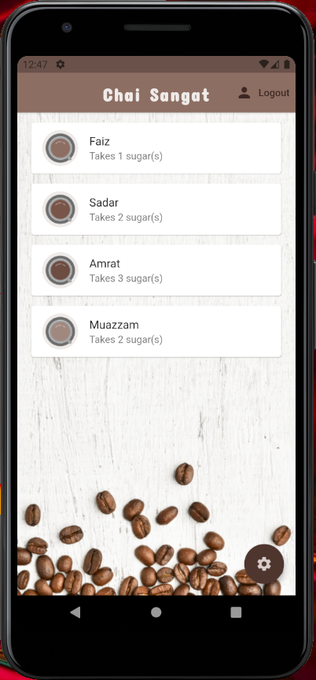
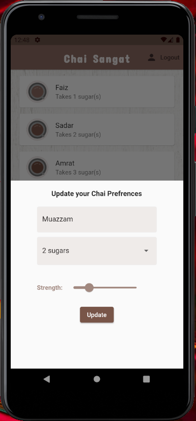

# Chai Sangat

A Flutter project with firestore that helps you to store you and your buddies chai preferences,
so the next time someone is going to get chai, he/she knows what your perfect cup of chai looks like.

## Contributors:
19SW114 , 19SW111, 19SW112, 19SW18

## Usecase:

Suppose you are working in a office and everyday a different person goes to get chai for all colegues,
and everytime that needs to ask everyone about their prefered chai like how much sugar they want or how strong they like their tea etc.
So, this App solves this problem and let everyone login and save their prefrences of chai along with their names, and the best part is
you can change those preferences anytime by logging into your account.
So next time whoever goes to get chai for all, he can lookup in the app and get everyone their perfect cup of tea.

## Features:
- Firebase Authentication with email and password
- Beautiful UI
- Update prefrences anytime with settings icon at bottom right
- Brown themed UI
- Unlimited users

## Screenshots:
Sign In Screen:

Home Screen:

Settings Screen:

A few resources to get you started if this is your first Flutter project:

- [Lab: Write your first Flutter app](https://flutter.dev/docs/get-started/codelab)
- [Cookbook: Useful Flutter samples](https://flutter.dev/docs/cookbook)

For help getting started with Flutter, view our
[online documentation](https://flutter.dev/docs), which offers tutorials,
samples, guidance on mobile development, and a full API reference.
